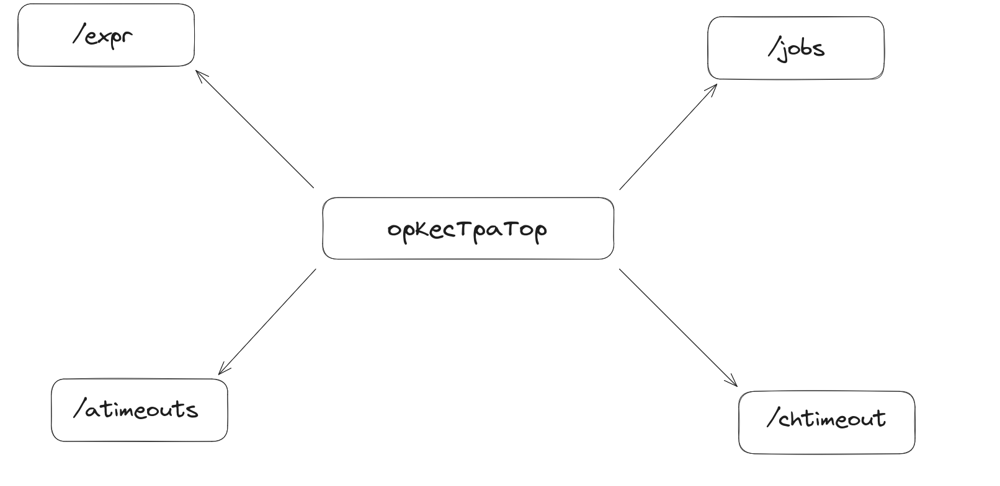
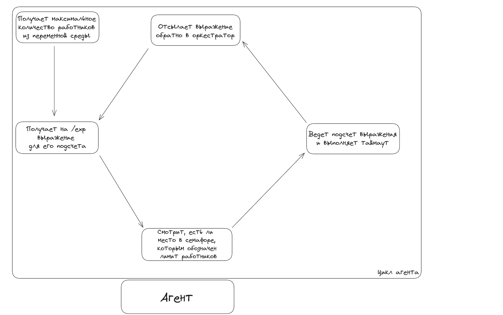
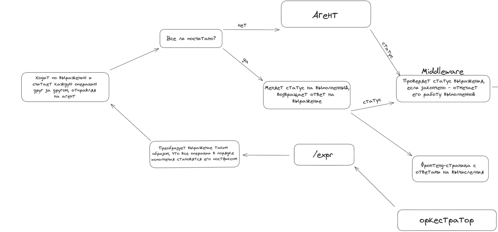
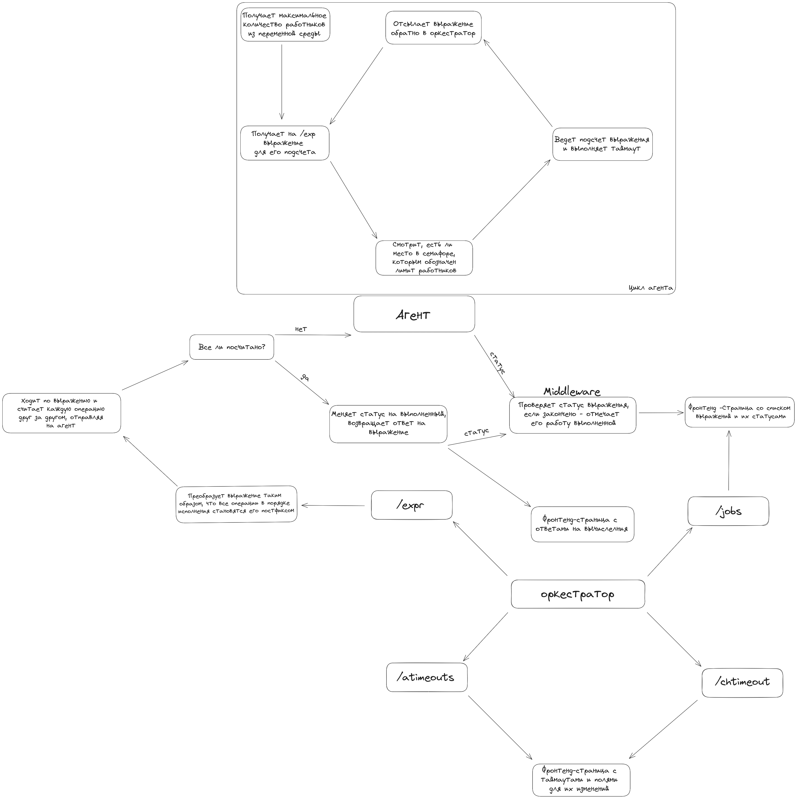

# Установка

Чтобы установить проект, используйте следующий код:
```sh 
git clone https://github.com/oberstw/yandexcalc/
cd yandexcalc/calc/
cd agent
go get 
go build
cd ../orch
go get 
go build
```
Затем, чтобы запустить, введите следующий код:
```sh
cd yandexcalc/calc/
./agent/agent
./orch/orchestrator
```

# Принцип работы

В данном проекте существует три главных раздела: агент, оркестратор и фронтенд-часть. 

У оркестратора на данный момент существует 2 эндпоинта:

Эндпоинт /expr создает выражение, которое он отправляет на агент
Эндпоинт /jobs дает ответ в виде списка всех выражений и их статуса: в работе/успешно посчитаны/не посчитаны
Также оператору будут добавлены еще два эндпоинта:
/atimeouts - эндпойнт, возвращающий таймауты для каждой операции на данный момент
/chtimeout - эндпойнт, меняющий таймаут для какой-то конкретной операции

Агент работает достаточно просто: при получении выражения на /exp, агент проверяет, есть ли место в семафоре для еще одного процесса-работника и, если да, создает таковой и на нем считает часть выражения с таймаутом. Цикл работы агента представлен ниже:

Самый главный endpoint всего проекта - /expr. Он и отсылает выражение на агент для подсчета, и преобразует его для такового. Принцип его работы - на картинке:


Ниже прикрепляется общая диаграмма всего проекта (некоторые части, такие как фронтенд-страницы, будут добавлены в ближайшее время в коммитах.)
