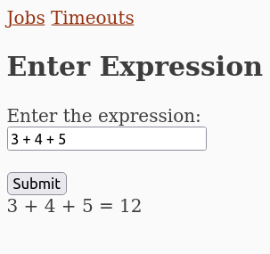
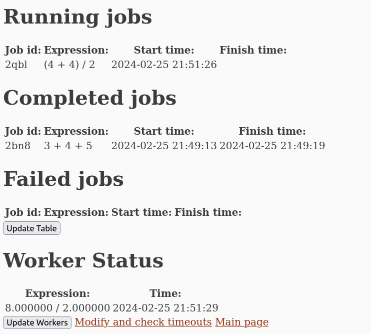
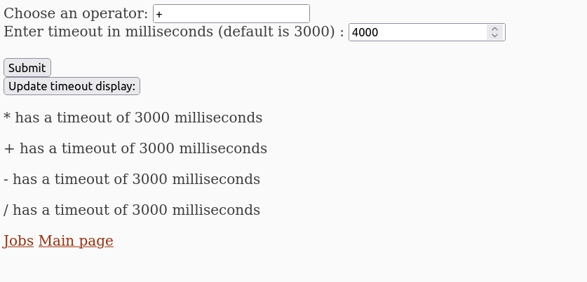

# Установка

Чтобы установить проект, используйте следующий код:
```sh 
git clone https://github.com/oberstw/yandexcalc/
cd yandexcalc/calc/
cd agent
go get 
go build
cd ../orch
go get 
go build
cd ../frontend
go get
go build
```
Затем, чтобы запустить, откройте три окна терминала для каждого из процессов и впишите в каждое один из трех скриптов ниже:
```sh
cd yandexcalc/calc/agent
./agent
```
```sh
cd yandexcalc/calc/orch
./orch
```
```sh
cd yandexcalc/calc/frontend
./frontend
```

Затем перейдите по ссылке: http://127.0.0.1:8040/expr

В случае возникших вопросов по установке и/или использованию, создайте Issue к этому проекту. Также можно написать в телеграм @owwwwm

# Принцип работы

В данном проекте существует три главных раздела: агент, оркестратор и фронтенд-часть. 

У оркестратора на данный момент существует 4 эндпоинта:

Эндпоинт /expr создает выражение, которое он отправляет на агент
Эндпоинт /jobs дает ответ в виде списка всех выражений и их статуса: в работе/успешно посчитаны/не посчитаны
/atimeouts - эндпойнт, возвращающий таймауты для каждой операции на данный момент
/chtimeout - эндпойнт, меняющий таймаут для какой-то конкретной операции

Агент работает достаточно просто: при получении выражения на /exp, агент проверяет, есть ли место в семафоре для еще одного процесса-работника и, если да, создает таковой и на нем считает часть выражения с таймаутом. Цикл работы агента представлен ниже:

Самый главный endpoint всего проекта - /expr. Он и отсылает выражение на агент для подсчета, и преобразует его для такового. Принцип его работы - на картинке:


Ниже прикрепляется общая диаграмма всего проекта (некоторые части, такие как фронтенд-страницы, будут добавлены в ближайшее время в коммитах.)


# Примеры использования:

Первый пример: выражение. Вводится выражение в поле "Enter the Expression". Затем нужно дождаться, пока оно пройдет через сервер и увидеть результат.


Во время выполнения выражения можно пройти на страницу /jobs и там посмотреть выполняемое выражение, а так же воркеров, ответственных в данный момент за него:


У воркеров время отображения - время, когда они начали работу.

Третья же страница - timeouts - отвечает за задачу таймаутов для каждой операции по отдельности. Вот как она выглядит:


Таймауты задаются в миллисекундах(1 секунда - 1000 миллисекунд). Дефолтное значение - 3000, то есть три секунды.